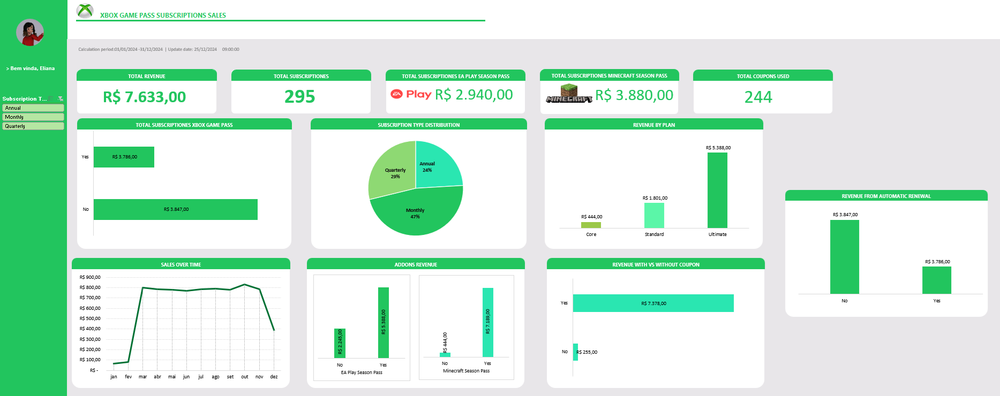

# 🎮 Dashboard de Vendas – Xbox Game Pass

## 📊 Sobre o Projeto

Este projeto apresenta a construção de um **dashboard de vendas no Excel**, com o objetivo de transformar dados brutos em **informações visuais claras e úteis** para análise de desempenho de vendas.

O dashboard foi desenvolvido para permitir uma **análise rápida e eficiente do comportamento de clientes**, desempenho dos planos de assinatura e impacto de cupons e produtos adicionais nas vendas.

A proposta do projeto é demonstrar habilidades de **análise de dados, organização de informações e visualização de indicadores de negócio**.

---
Este projeto apresenta a construção de um **Dashboard de Vendas no Excel** utilizando dados de assinaturas do **Xbox Game Pass**.

O objetivo é transformar **dados brutos em informações visuais e insights de negócio**, permitindo compreender o comportamento dos clientes, identificar fontes de receita e apoiar a tomada de decisão baseada em dados.

O dashboard analisa:

- Receita total de assinaturas
- Preferência de planos
- Impacto de add-ons nas vendas
- Uso de cupons de desconto
- Evolução das vendas ao longo do tempo
- Receita por tipo de assinatura

Este projeto demonstra habilidades de:

- análise de dados
- visualização de dados
- pensamento analítico
- construção de dashboards

---

# 🎯 Problema de Negócio

Plataformas de assinatura de jogos precisam entender:

- Quais planos geram mais receita
- Quais tipos de assinatura são mais populares
- Se add-ons aumentam o valor gasto pelos clientes
- O impacto dos cupons nas vendas
- Como as vendas evoluem ao longo do tempo

O dashboard foi desenvolvido para responder essas perguntas.

---

# 📂 Descrição da Base de Dados

A base contém informações sobre assinantes do Xbox Game Pass e compras adicionais.

## Colunas da base

| Coluna | Descrição |
|------|------|
| Subscriber ID | Identificador do cliente |
| Name | Nome do cliente |
| Plan | Plano de assinatura |
| Start Date | Data de início da assinatura |
| Auto Renewal | Indica renovação automática |
| Subscription Price | Preço da assinatura |
| Subscription Type | Tipo de assinatura (Monthly, Quarterly, Annual) |
| EA Play Season Pass | Compra do add-on EA Play |
| EA Play Season Pass Price | Preço do add-on EA Play |
| Minecraft Season Pass | Compra do add-on Minecraft |
| Minecraft Season Pass Price | Preço do add-on Minecraft |
| Coupon Value | Valor do cupom utilizado |
| Total Value | Valor total pago |

---

# 📊 Principais Métricas (KPIs)

O dashboard apresenta os seguintes indicadores:

- Receita Total: **R$ 7.633**
- Total de Assinaturas: **295**
- Receita EA Play Pass: **R$ 2.940**
- Receita Minecraft Pass: **R$ 3.880**
- Total de Cupons Utilizados: **244**

---

# 📈 Análise Exploratória de Dados

A análise inicial dos dados revelou algumas tendências importantes.

### Preferência de tipo de assinatura

| Tipo | Quantidade |
|------|------|
| Monthly | 139 |
| Quarterly | 85 |
| Annual | 71 |

**Insight**

A maioria dos clientes prefere assinaturas **mensais**, possivelmente por oferecer maior flexibilidade.

---

### Receita por plano

| Plano | Receita |
|------|------|
| Core | R$ 444 |
| Standard | R$ 1.801 |
| Ultimate | R$ 5.388 |

**Insight**

O plano **Ultimate gera a maior parte da receita**.

---

### Impacto dos add-ons

Clientes que compram add-ons apresentam maior gasto total.

EA Play:

- Sem add-on → R$ 2.245
- Com add-on → R$ 5.388

Minecraft Pass:

- Sem add-on → R$ 444
- Com add-on → R$ 7.189

**Insight**

Add-ons aumentam significativamente o valor gasto pelos clientes.

---

### Uso de cupons

| Cupom | Receita |
|------|------|
| Sem cupom | R$ 255 |
| Com cupom | R$ 7.378 |

**Insight**

Cupons são amplamente utilizados pelos clientes.

---

# 📊 Dashboard

Exemplo do dashboard desenvolvido:

---

# 🛠 Ferramentas Utilizadas

- Microsoft Excel
- Tabelas Dinâmicas
- Gráficos de visualização de dados
- Análise exploratória de dados

---

# 💡 Principais Insights de Negócio

A análise dos dados revelou:

- O plano **Ultimate domina a geração de receita**
- Assinaturas **mensais são as mais populares**
- Add-ons aumentam significativamente o valor gasto por cliente
- Cupons têm grande influência nas compras
- As vendas permanecem relativamente estáveis ao longo do tempo

---

# 🚀 Possíveis Evoluções do Projeto

Este projeto pode ser expandido com técnicas de ciência de dados, como:

- Análise exploratória com **Python (Pandas)**
- Modelos de **previsão de receita**
- Segmentação de clientes
- Modelos de **churn prediction**
- Dashboards interativos em **Power BI ou Tableau**

---

# 👩‍💻 Autora

**Liliane R. Refatti**
Cientista de Dados | Python | SQL | Power BI | Estatística | Mestre em Matemática

---
